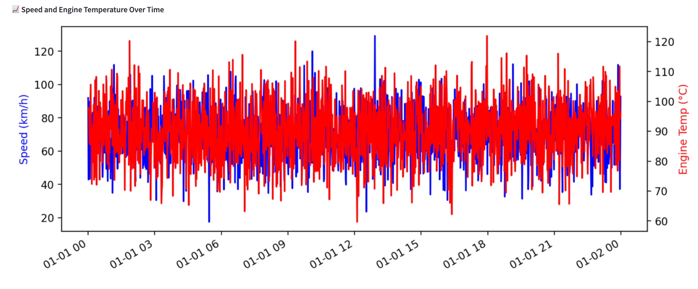

# Fleet Health Monitoring Dashboard

A comprehensive dashboard solution for monitoring and analyzing vehicle fleet health data. This application provides real-time insights, predictive maintenance capabilities, and detailed analytics for fleet management.

## 🌟 Features

- **Real-time Telemetry Monitoring**: Track vehicle performance metrics in real-time
- **Predictive Maintenance**: AI-powered predictions for potential maintenance needs
- **Interactive Visualizations**: Dynamic charts and graphs for data analysis
- **Azure SQL Integration**: Seamless connection with Azure SQL database
- **Customizable Alerts**: Set up alerts for critical metrics and thresholds

## 🛠️ Technical Stack

- **Frontend**: Streamlit
- **Backend**: Python
- **Database**: Azure SQL
- **Data Processing**: Pandas, NumPy
- **Visualization**: Plotly, Matplotlib
- **Machine Learning**: Scikit-learn

## 📋 Prerequisites

- Python 3.8 or higher
- Azure SQL database credentials
- Git

## 🚀 Setup Instructions

1. **Clone the Repository**
   ```bash
   git clone [repository-url]
   cd fleet_health_monitoring
   ```

2. **Create Virtual Environment**
   ```bash
   python -m venv venv
   source venv/bin/activate  # On Windows: venv\Scripts\activate
   ```

3. **Install Dependencies**
   ```bash
   pip install -r requirements.txt
   ```

4. **Configure Environment Variables**
   Create a `.env` file in the root directory with:
   ```
   AZURE_SQL_CONNECTION_STRING=your_connection_string
   ```

5. **Run the Application**
   ```bash
   streamlit run app/streamlit_app.py
   ```

## 📁 Project Structure

```
fleet_health_monitoring/
├── app/                    # Main application code
│   ├── streamlit_app.py    # Streamlit dashboard
│   └── utils/             # Utility functions
├── etl/                   # Data processing scripts
│   ├── data_loader.py     # Data loading utilities
│   └── data_simulator.py  # Data simulation tools
├── data/                  # Data storage
│   ├── raw/              # Raw data files
│   └── processed/        # Processed data files
├── tests/                # Test suite
│   ├── unit/            # Unit tests
│   └── integration/     # Integration tests
└── requirements.txt      # Project dependencies
```

## 📸 Dashboard Preview



## 🚀 Deployment

### Local Deployment
1. Follow the setup instructions above
2. Run the application using `streamlit run app/streamlit_app.py`
3. Access the dashboard at `http://localhost:8501`

### Streamlit Cloud Deployment
1. Fork this repository to your GitHub account
2. Visit [streamlit.io/cloud](https://streamlit.io/cloud)
3. Click "New app" and connect your repository
4. Set the main file path to: `app/streamlit_app.py`
5. Configure environment variables in the Streamlit Cloud dashboard
6. Deploy and access your dashboard

## 🔧 Configuration

The application can be configured through:
- Environment variables
- `.streamlit/config.toml` for Streamlit-specific settings
- Azure SQL connection settings

## 🤝 Contributing

1. Fork the repository
2. Create a feature branch
3. Commit your changes
4. Push to the branch
5. Create a Pull Request

## 📝 License

This project is licensed under the MIT License - see the [LICENSE](LICENSE) file for details.

## 👥 Support

For support, please:
1. Check the [documentation](docs/)
2. Open an issue in the repository
3. Contact the maintainers

## 🔄 Updates

Stay updated with the latest changes by:
- Watching the repository
- Following the release notes
- Checking the changelog


